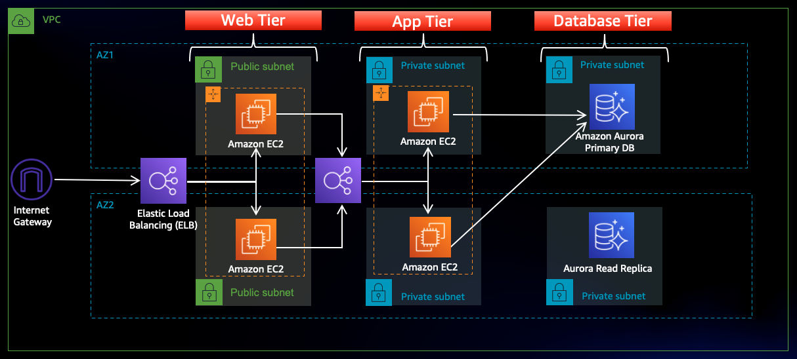

# AWS Three-Tier Architecture

A production-grade, highly available three-tier web application architecture deployed on AWS — built for scalability, fault tolerance, and security.

---

## Architecture Overview

This architecture separates the application into three logical and physical tiers — **Web**, **Application**, and **Database** — each isolated in its own subnet and security boundary within a single VPC, spread across two Availability Zones (AZs) for high availability.

---

## Infrastructure Components

| Component | Description |
|---|---|
| **VPC** | Logically isolated section of the AWS cloud |
| **Availability Zones** | Deployed across 2 AZs for fault tolerance |
| **Public Subnets** | Host the external-facing Web Tier |
| **Private Subnets** | Host the App Tier and Database Tier (no direct internet access) |

---

## Tier Breakdown

### 🌐 Web Tier
> The entry point for users — handles HTTP/HTTPS requests and delivers the front-end interface.

- **Internet Gateway (IGW)** — Connects the VPC to the public internet
- **Elastic Load Balancer (ELB)** — Distributes incoming traffic across web servers in both AZs
- **EC2 Instances** — Web servers running in public subnets across AZ1 and AZ2

### ⚙️ Application Tier
> Processes the business logic of the application.

- **Internal Load Balancer** — Bridges the Web and App tiers; balances traffic across internal app servers
- **EC2 Instances** — Reside in private subnets; receive requests from the Web Tier, process data, and query the database

### 🗄️ Database Tier
> Provides secure and persistent storage of application data.

- **Amazon Aurora (Primary DB)** — Main read/write database engine in AZ1
- **Amazon Aurora Read Replica** — Replica in AZ2 for high availability and improved read performance

---

## Security

- **Security Groups** act as virtual firewalls with least-privilege rules:
  - Web Tier SG accepts traffic from the internet (ports 80/443)
  - App Tier SG accepts traffic **only** from the Web Tier SG
  - Database Tier SG accepts traffic **only** from the App Tier SG
- App and Database tiers are in **private subnets** — not reachable directly from the internet

---

## Key Benefits

| Feature | Detail |
|---|---|
| **High Availability** | Dual-AZ deployment targets 99.99% uptime |
| **Scalability** | Each tier uses Auto Scaling Groups to handle traffic spikes independently |
| **Security** | Layered subnet isolation + security group chaining |
| **Performance** | Aurora Read Replica offloads read queries from the primary DB |

---

## Tech Stack

- **Cloud Provider:** AWS
- **Compute:** Amazon EC2
- **Load Balancing:** Elastic Load Balancing (ELB)
- **Database:** Amazon Aurora (MySQL/PostgreSQL compatible)
- **Networking:** VPC, Public & Private Subnets, Internet Gateway
- **Security:** Security Groups

---

## Author

**Khem Bahadur Singh**  
Cloud & DevOps Engineer  
GitHub: [@kbsingh10](https://github.com/kbsingh10)
